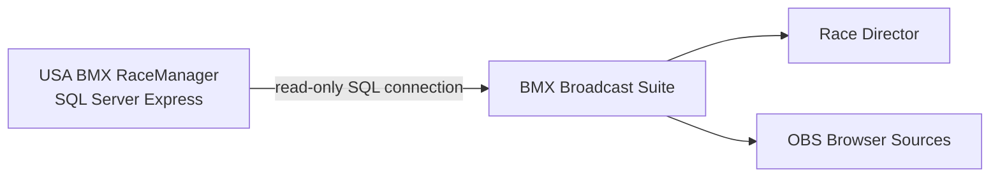
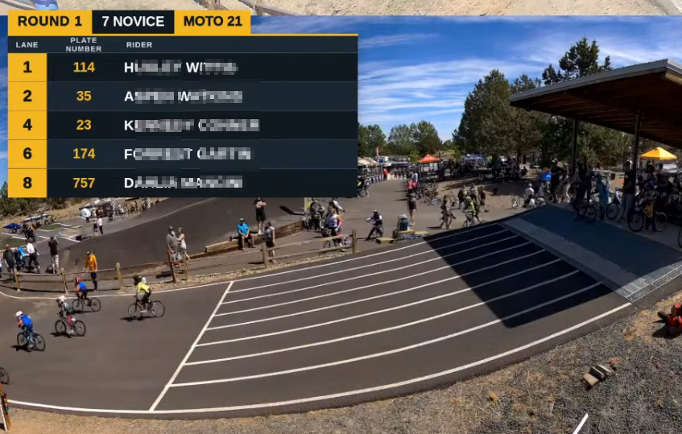
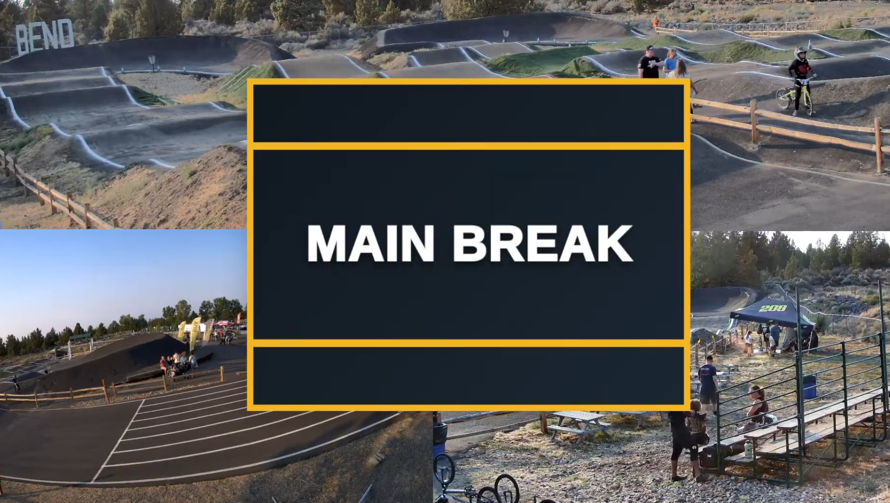
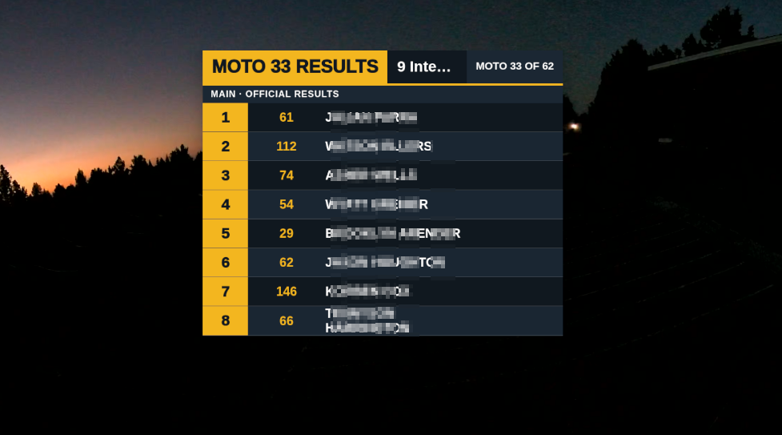
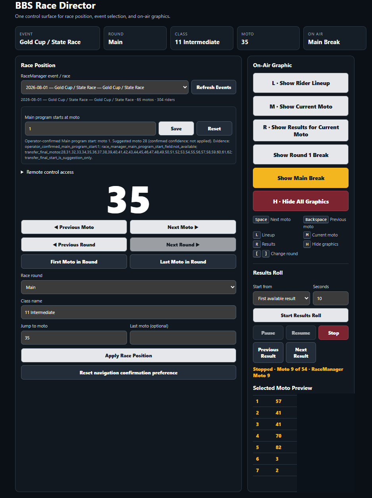
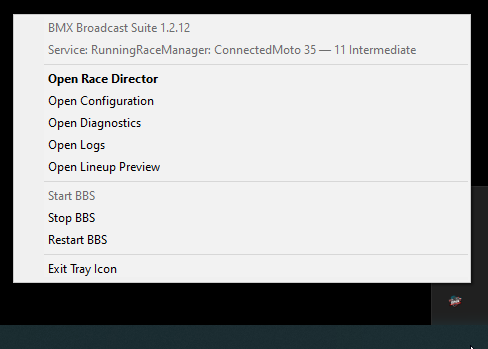

# BMX Broadcast Suite

BMX Broadcast Suite (BBS) turns live USA BMX RaceManager data into practical broadcast controls and OBS graphics. It reads the SQL Server `RACE` database without modifying RaceManager tables or race data, gives the producer a browser-based Race Director, and supplies transparent Browser Source overlays for OBS Studio.

[Download the latest Windows MSI](https://github.com/vrpt576/BMX-Broadcast-Suite/releases/latest) or use the [documentation index](docs/README.md) for Windows and Linux setup.

Most tracks run RaceManager on a Windows PC or server and run BBS with OBS on a separate broadcast computer on the same trusted LAN. BBS can also run directly on the RaceManager computer. In either layout, never expose the SQL Server port to the public Internet.

## What it looks like

### Overlay

### Race Director

Race Director keeps event selection, round and moto navigation, class context, on-air graphics, results playback, and a sanitized lineup preview on one production screen.

### Windows tray controls

The Windows tray menu shows service, database, moto, and class status and provides quick links to Race Director, Configuration, Diagnostics, and logs without leaving a console window open.

## First-time setup

1. [Prepare the USA BMX RaceManager PC for BBS](docs/racemanager-pc-setup.md), including TCP/IP, a dedicated read-only login, and a restricted firewall rule when BBS runs on another computer.
2. Install Microsoft ODBC Driver 18 for SQL Server and the [latest BBS Windows MSI](https://github.com/vrpt576/BMX-Broadcast-Suite/releases/latest) on the BBS/OBS computer.
3. Open **Configuration** and enter the SQL host, discovered TCP port, `RACE` database, and dedicated read-only credentials.
4. Open **Diagnostics** and confirm that the driver, SQL connection, database, and current event checks pass.
5. Open **Race Director**, select the live or historical event, and confirm the moto, round, and class.
6. Add the [overlay URLs](docs/browser-sources.md) to OBS as Browser Sources.

For a detailed Windows walkthrough, continue with [Windows Installation](docs/installation-windows.md), [First Run](docs/first-run.md), and [OBS Setup](docs/obs-setup.md).

## Current status — v1.2.17

BBS can select live or historical RaceManager events, resolve exact qualifier and final stages, and display current-moto, lineup, official results, and break graphics in OBS. Version 1.2.17 fixes a third qualifying moto being announced as "Main" for a class that still races a separate final, so a class is never shown as Main twice, while retaining the Ref.Rounds bracket-name resolution from v1.2.16 and the theme and tray fixes from v1.2.15.

### Rider subtitle data

Rider age is the racing age stored by RaceManager in
`MB.Race_Riders.Age_Race`; BBS does not derive it from the displayed class
name. A class may combine an age range, so its label can legitimately differ
from an individual rider's racing age. Home track is displayed exactly as
stored in the event's `MB.Race_Riders.Home_Track` field. If either value is
missing, its part of the subtitle is omitted cleanly.

Validated RaceManager behavior in this release:

- `Round_Type_ID 123` contains qualifier or moto progression.
- `Round_Type_ID 1` contains final classification.
- `Moto_Number` is not globally unique; exact stages use `Motogroup_DBID` and round identity.
- `X` finish values are transfer-to-main markers, not numeric placements.
- Transfer/LST and Total Points are scoring methods, not Director rounds.
- The Main program can interleave Transfer Main events and final Total Points motos in physical gate-drop order.
- Director stores an optional Main-program start per event when RaceManager does not expose a reliable event-wide boundary; automatic Transfer evidence is advisory only.
- Total Points results use the accumulated official classification while the Director remains in **Main**.
- Quarterfinal and semifinal controls are shown only when a future validated mapping proves those stages exist in the selected RaceManager data.

### Available now

- Read-only Microsoft SQL Server integration with the RaceManager `RACE` database
- Automatic compatibility with RaceManager schemas with or without `MB.Race_Riders.Nickname`
- Live and historical event selection with persistent `motoboard_id`
- Round-aware class programs with dynamic qualifier and final-stage controls
- Stable motogroup identities even when qualifier and final branches reuse moto numbers
- Current event, moto, class, exact stage, rider lineup, gate, plate, transfer, and entered-result APIs
- Phase-aware Next/Previous Moto movement within the branch currently on air
- OBS browser sources for current moto, lineup, Main results, and broadcast breaks
- Server-owned Results Roll with pause/resume, manual navigation, and stop-at-last behavior
- WebSocket updates with HTTP polling fallback
- Last-known-good lineup resilience with stale-data indication
- Track configuration UI, diagnostics dashboard, logs, and downloadable log files
- Machine-wide Ubuntu `systemd` service and Windows startup/tray integrations
- Theme packages with expanded per-element color customization

### Known limitations

- Actual quarterfinal and semifinal storage has not yet been validated against a sufficiently large historical RaceManager class, so BBS does not invent those mappings.
- Transfer versus Total Points finalization is inferred from structural evidence and can be overridden per event without creating another navigation phase.
- Total Points Round-3-versus-Main placement requires an explicit event boundary when RaceManager does not provide one; Director shows a low-confidence suggestion and lets the operator save or reset the event-scoped value.
- Timing gate, ProStart, rider photos, rankings, and automatic graphic sequencing are not yet integrated.
- The in-app Theme Manager (`/themes`) covers supported colors and typography; new color keys or layout changes still require editing `theme.json` directly.

## Quick reference

On Ubuntu, begin with [Linux Installation](docs/installation-linux.md) and [Linux Service and Tray](docs/service-linux.md). On Windows, use [Windows Installation](docs/installation-windows.md), the [Windows MSI Installer](docs/wizard-installer-windows.md), and [Windows Service and Tray](docs/service-windows.md). See [RaceManager Round Model](docs/racemanager-round-model.md) for the round-aware architecture.

Common pages:

- Configuration: `http://localhost:8000/configuration`
- Diagnostics: `http://localhost:8000/diagnostics`
- Race Director: `http://localhost:8000/director`
- Controller: `http://localhost:8000/controller`
- Current overlay: `http://localhost:8000/overlay/current`
- Lineup overlay: `http://localhost:8000/overlay/lineup`
- Results overlay: `http://localhost:8000/overlay/results`
- Shared Round/Main break overlay: `http://localhost:8000/overlay/break`

Add `?preview=true` when building or testing an OBS scene. Remove it for live controller-driven operation.

## Round-aware API highlights

- `GET /api/event` — recent live and historical RaceManager events
- `GET /api/current/program` — phases actually available for the selected class/group
- `GET|PUT /api/current/main-program-boundary/{motoboard_id}` — inspect or save the event Main start
- `POST /api/current/main-program-boundary/{motoboard_id}/reset` — clear the event Main start
- `POST /api/current/phase/select/{phase}` — select an exact available phase
- `GET /api/motos?all_rounds=true` — inspect qualifier and final branches without collapsing duplicate moto numbers
- `GET /api/motos/group/{motogroup_id}` — retrieve one exact motogroup
- `GET /api/lineup/current` — exact-stage gates and riders
- `GET /api/results/current` — numeric placements plus separate transfer status
- `GET /api/results/status` — persistent server-owned Results Roll state
- `POST /api/results/start|pause|resume|previous|next|stop` — timed and manual results playback
- `POST /api/breaks/show/{round_1|main}` — show a validated broadcast-break preset

## Themes

Select a theme with `?theme=default` or set `BBS_DEFAULT_THEME`. Theme packages live in `themes/<slug>/theme.json`. See [Theme Customization](docs/themes.md).

## Project layout

- `database/` — RaceManager SQL queries and read-only database client
- `connector/` — FastAPI application, stage resolvers, platform tray applications, and APIs
- `overlay/` — overlay guidance and future reusable front-end assets
- `controller/` — broadcast controller guidance
- `themes/` — track-specific theme packages
- `packaging/` and `scripts/` — Linux and Windows background, tray, and installation tooling
- `docs/` — setup, operation, troubleshooting, and architecture documentation
- `tests/` — unit, resilience, event-selection, and round-model regression tests

## Roadmap

The near-term race-data priority is validating genuine quarterfinal and semifinal structures from a class large enough to generate them. Other priorities include expanding the Theme Manager with live preview and color pickers, automatic graphic sequencing, timing/ProStart integration, rider media, rankings, and multi-track deployment. See [ROADMAP.md](ROADMAP.md).

## Contributing

Contributions from BMX organizers, broadcasters, designers, and developers are welcome. Read [CONTRIBUTING.md](CONTRIBUTING.md) before opening an issue or pull request. Never commit `.env`, SQL passwords, logs, virtual environments, or local runtime state.

## License

BMX Broadcast Suite is released under the MIT License. See [LICENSE](LICENSE).
